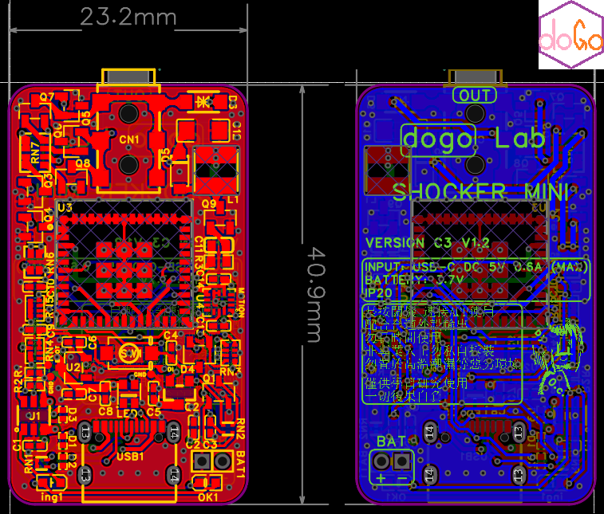
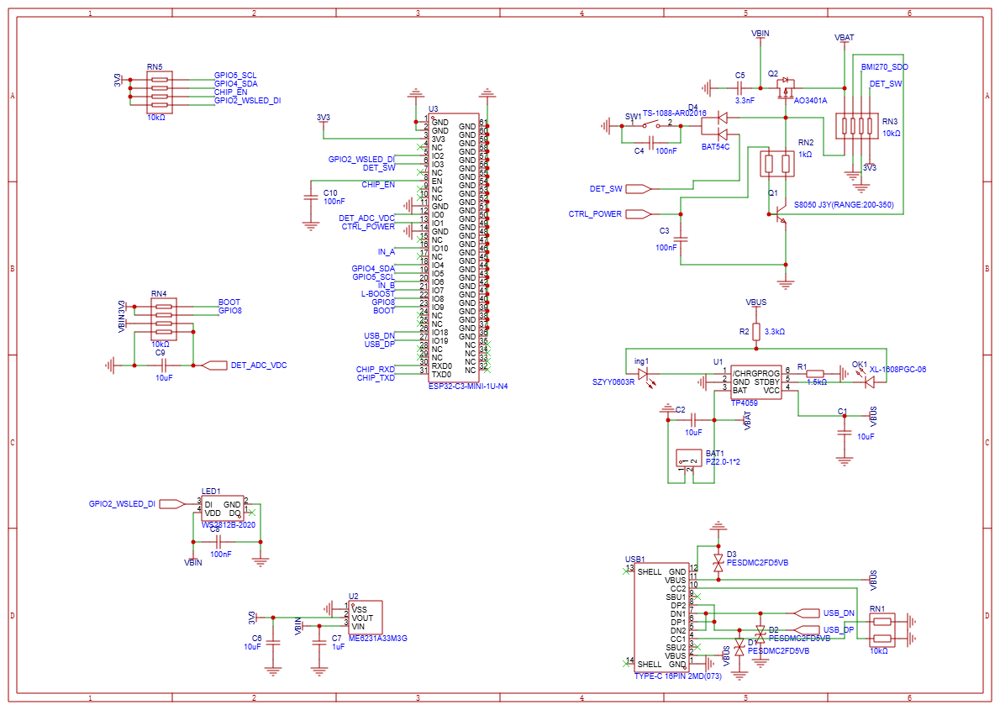
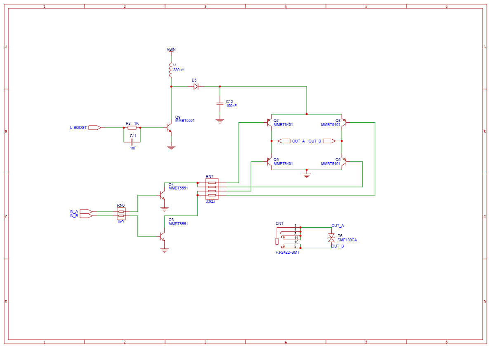
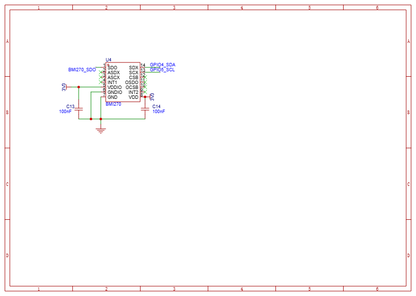

## 硬件

We recommend **dogoLab_shocker_c3_version1.2**

You can just download PCB Gerber or check project files in easyEDA.

- **shockerMiniC3** 主控基於esp32c3。boost升壓，H橋輸出脈衝，2.5mm耳機孔輸出。傳感器帶BMI270躰動。ws2812彩燈一顆。可編程按鈕一個。typeC數據加充電，tp4095充電管理。USB for DEV。

- **shockerMiniC2** 主控基於esp32c2。boost升壓，H橋輸出脈衝，2.5mm耳機孔輸出。傳感器帶BMI270躰動。ws2812彩燈一顆。可編程按鈕一個。typeC數據加充電，tp4095充電管理。backPad for DEV。

- **switcherMiniC3** 主控基於esp32c3.傳感器帶mx30102心率血氧，BMI270躰動，拉力按鈕，手勢感應。預發佈

---

### PCB设计

  

  <em>图：dogoLab_shocker_c3_version1.2_PCB 设备整体PCB设计图</em>

---

### 原理图

  

  <em>图：dogoLab_shocker_c3_version1.2_coreSystemPart_Schematic 主控与电源等控制电路原理图</em>

  

  <em>图：dogoLab_shocker_c3_version1.2_emsPart_Schematic EMS电刺激功能电路原理图</em>

  

  <em>图：dogoLab_shocker_c3_version1.2_imuPart_Schematic IMU体动传感器模块原理图</em>

---

### 📍 外设接口引脚表 PCB External Pin Definition

#### 🧠 **ESP32-C3 Mini-1U Pinout**

| Signal Name    | MCU Pin | Direction | Function / Usage              | Voltage     |
| -------------- | ------- | --------- | ----------------------------- | ----------- |
| GPIO4_SDA      | IO4     | I/O       | I²C Data (BMI270)             | 3.3V        |
| GPIO5_SCL      | IO5     | I/O       | I²C Clock (BMI270)            | 3.3V        |
| GPIO2_WSLED_DI | IO2     | Output    | WS2812 Status LED             | 5V tolerant |
| GPIO8_BOOT     | IO8     | Input     | Boot Mode Select              | 3.3V        |
| CHIP_RXD       | RXD     | Input     | UART Receive                  | 3.3V        |
| CHIP_TXD       | TXD     | Output    | UART Transmit                 | 3.3V        |
| DET_ADC_VDC    | IO10    | ADC Input | Battery / VBUS Voltage Detect | 0–3.3V      |
| IN_A           | IO9     | Output    | H-Bridge Pulse Control A      | PWM         |
| IN_B           | IO10    | Output    | H-Bridge Pulse Control B      | PWM         |
| L-BOOST        | IO8     | Output    | Boost Enable (Q9)             | Digital     |
| CTRL_POWER     | IO7     | Output    | System Power Control          | Digital     |
| DET_SW         | IO6     | Input     | Mode Switch / User Button     | Digital     |

------

#### 🧭 **BMI270 IMU — I²C Sensor Connection**

| BMI270 Pin | Connected To | Description          |
| ---------- | ------------ | -------------------- |
| SDO        | GND          | I²C Address Select   |
| SDX / SDA  | GPIO4_SDA    | I²C Data             |
| SCX / SCL  | GPIO5_SCL    | I²C Clock            |
| INT1       | NC           | Interrupt (optional) |
| INT2       | NC           | Interrupt (optional) |
| VDD        | 3.3V         | Power Supply         |
| GND        | GND          | Ground               |

------

#### ⚡ **Stimulation H-Bridge Control Pins**

| Signal  | Connected To | Purpose                | Notes                   |
| ------- | ------------ | ---------------------- | ----------------------- |
| IN_A    | Q3 Base      | PWM control A          | Stimulation switching   |
| IN_B    | Q4 Base      | PWM control B          | Bipolar waveform        |
| L-BOOST | Q9 Base      | Boost Enable           | Enable DC-DC conversion |
| OUT_A   | CN1 Pin 1    | Stimulation Output (+) | External electrode      |
| OUT_B   | CN1 Pin 2    | Stimulation Output (–) | External electrode      |

------

#### 🔌 **Power Management & USB**

| Pin             | Function      | IC       | Notes                    |
| --------------- | ------------- | -------- | ------------------------ |
| VBAT            | Battery Input | TP4059   | 3.7–4.2V lithium battery |
| VBUS            | USB-C Power   | TP4059   | 5V from USB              |
| DET_ADC_VDC     | ADC Input     | ESP32-C3 | Battery / USB detect     |
| USB_DP / USB_DN | USB 2.0 Data  | ESP32-C3 | ESD Protected            |
| VBUS_OUT        | 5V output     | AO3401   | Boosted output           |

------

### The End

---

AD TIME~

## 🧭 相关开源项目

[**openTENS - 开源的电刺激模块**](https://github.com/0ingchun/openTENS)

  

---